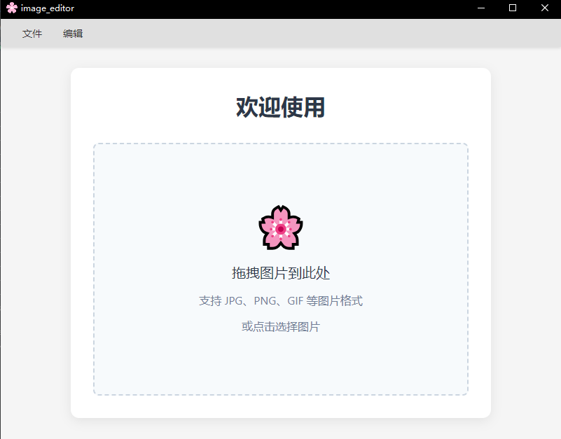
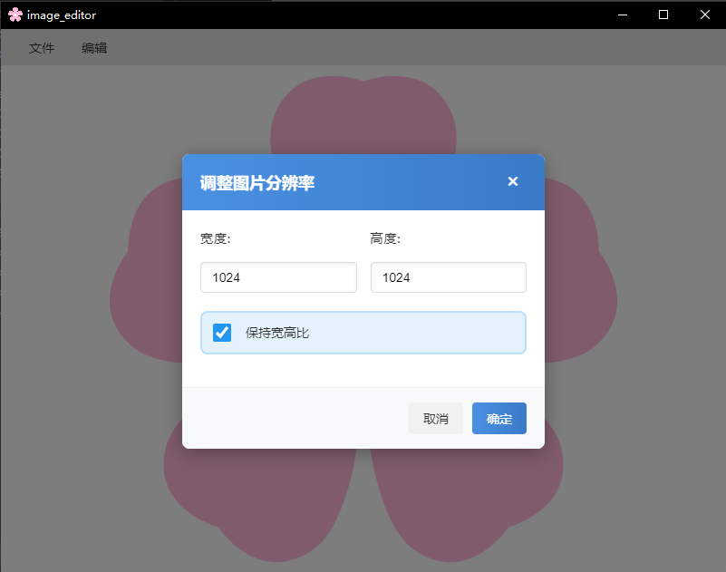
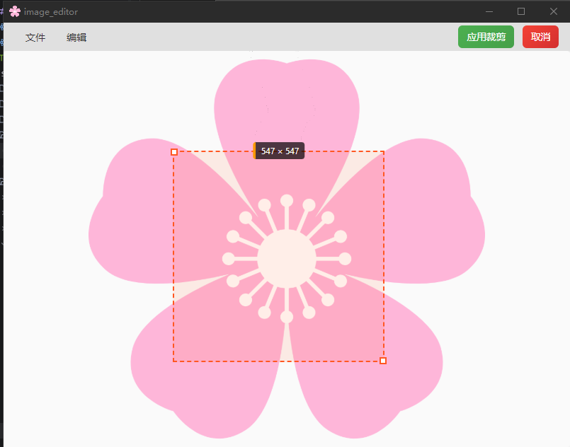

# ImageEditor
## debug
```
npm install
npm run tauri dev
```
## build
```
npm install
npm run tauri build
```
## Function
- Crop the image
- Resize the image
- Save the image in different formats (JPEG, PNG, ICO)

## Screenshot


