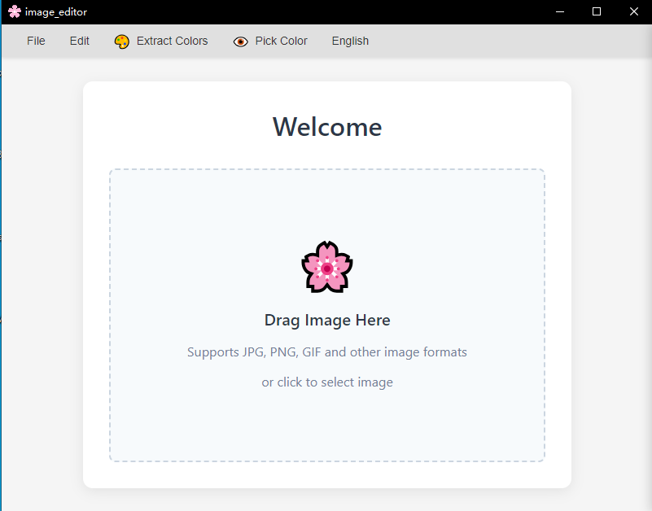
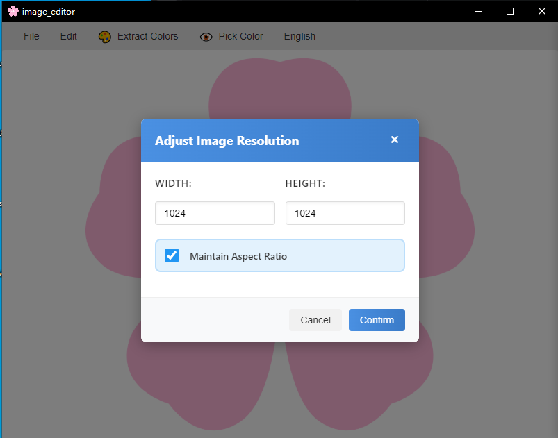
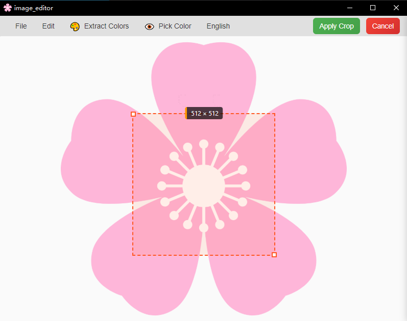
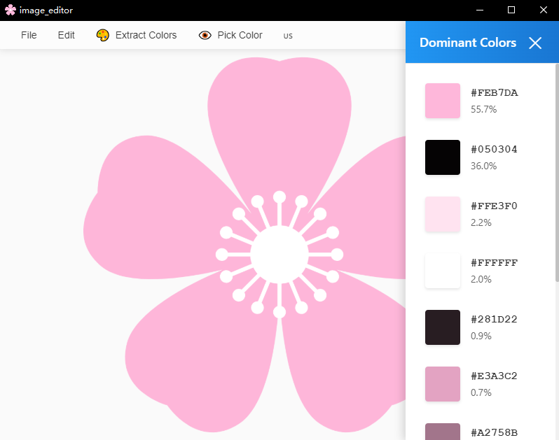

# ImageEditor
## Debug
```
npm install
npm run tauri dev
```
## Build
```
npm install
npm run tauri build
```
## Main Functions
- Crop the image
- Resize the image
- Save the image in different formats (JPEG, PNG, ICO)
- Extract colors from the image
- Pick color from the image
## Screenshot



